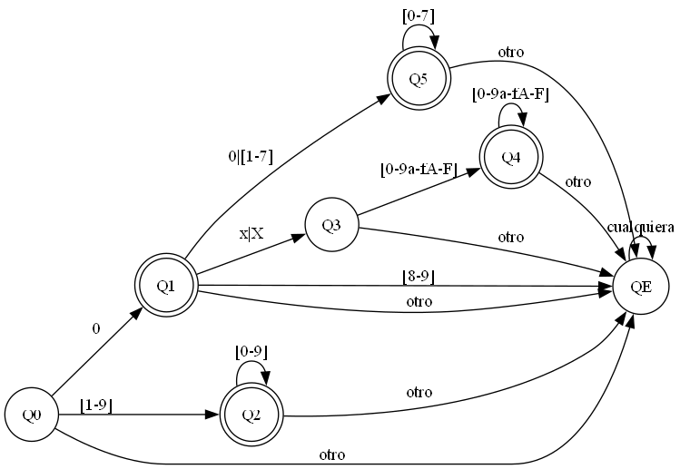

# Sintaxis y Semántica de los Lenguajes

# Trabajo Práctico #2 - AFD para Constantes Enteras

## Consigna

Implementar en C un programa que permita validar las distintas de constantes enteras de
C (Decimal, Octal, Hexadecimal). El mismo deberá leer palabras separadas por “,” de un
archivo de entrada (.txt) y que imprima por pantalla cada palabra indicando si es válida o no.
El programa debe contemplar la implementación de un autómata finito determinístico
(AFD) para la validación de palabras según estado final.

---

## Grafo del AFD

Imagen generada con Graphviz:

---

## Tabla de Tansiciones

| Estado | Entrada           | Próximo Estado |
| ------ | ----------------- | -------------- |
| **Q0** | `0`               | Q1             |
| Q0     | `[1-9]`           | Q2             |
| Q0     | otro              | QE             |
| **Q1** | `0`               | Q5             |
| Q1     | `[1-7]`           | Q5             |
| Q1     | `[8-9]`           | QE             |
| Q1     | `x` \| `X`        | Q3             |
| Q1     | otro              | QE             |
| **Q2** | `[0-9]`           | Q2             |
| Q2     | otro              | QE             |
| **Q3** | `[0-9a-fA-F]`     | Q4             |
| Q3     | otro              | QE             |
| **Q4** | `[0-9a-fA-F]`     | Q4             |
| Q4     | otro              | QE             |
| **Q5** | `[0-7]`           | Q5             |
| Q5     | otro              | QE             |
| **QE** | cualquier entrada | QE             |
